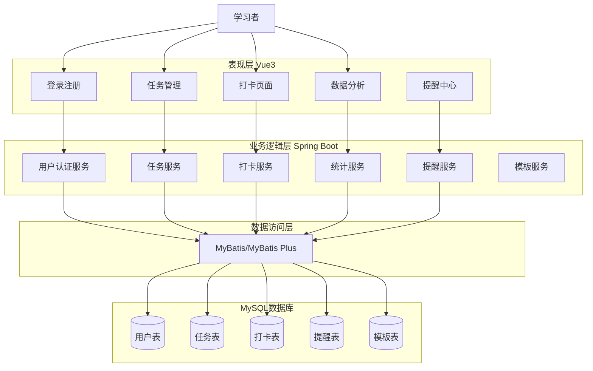
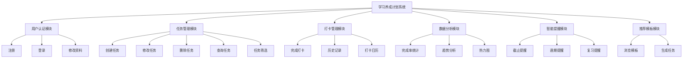
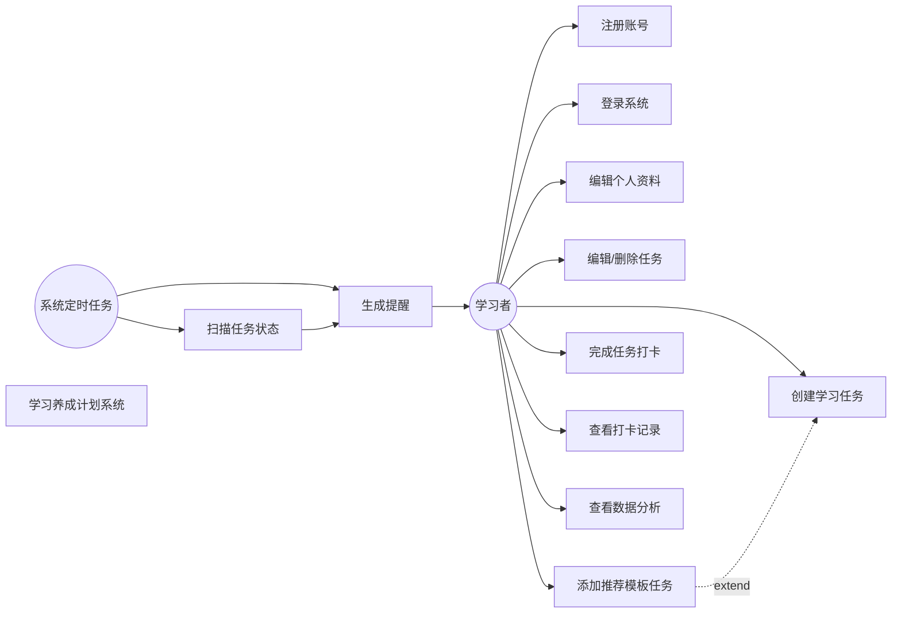
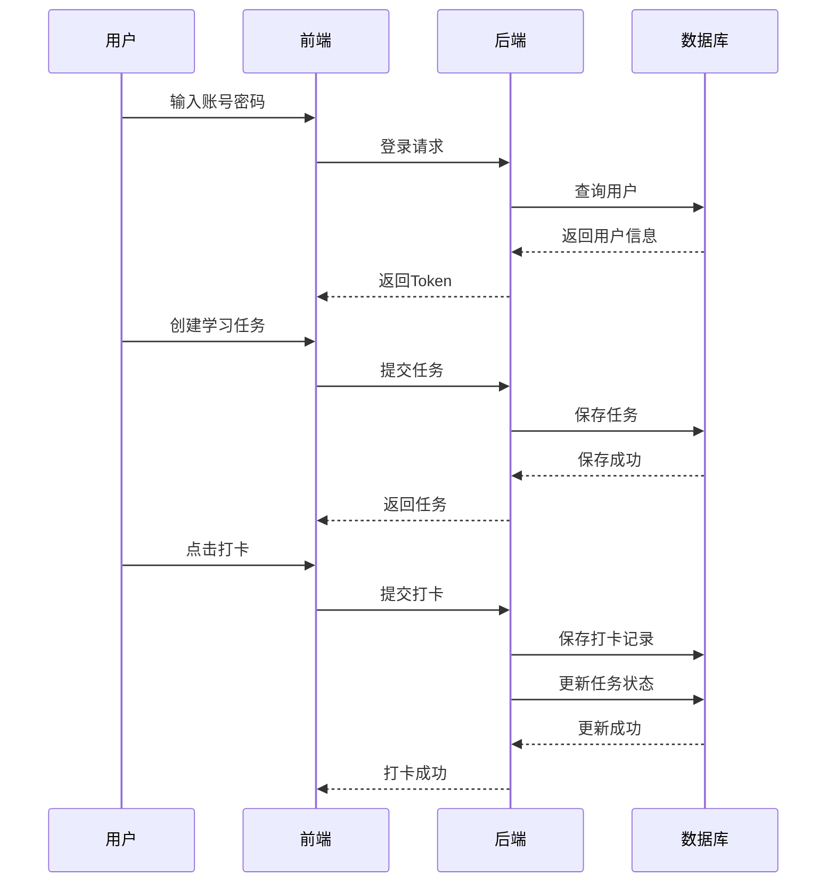
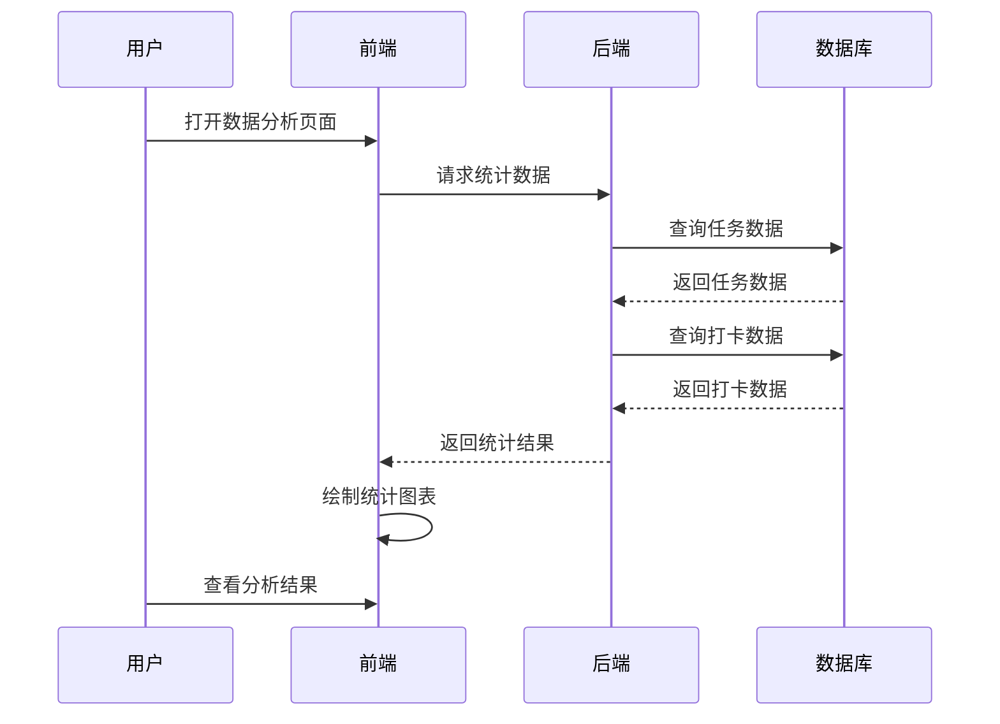
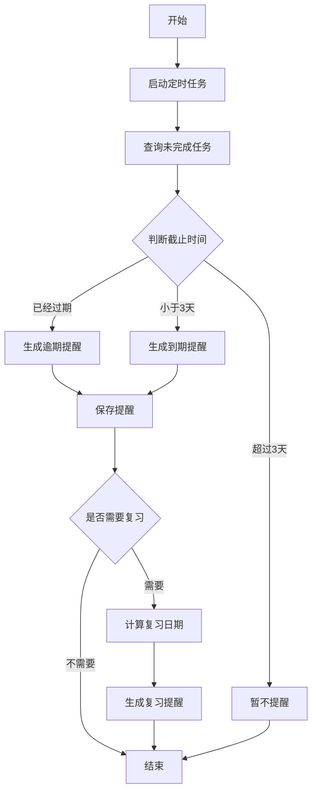
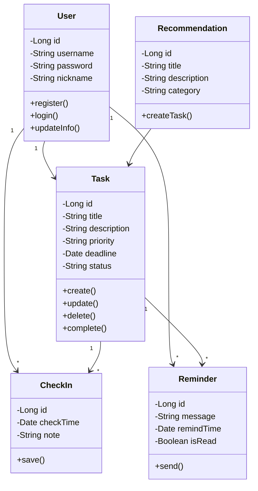
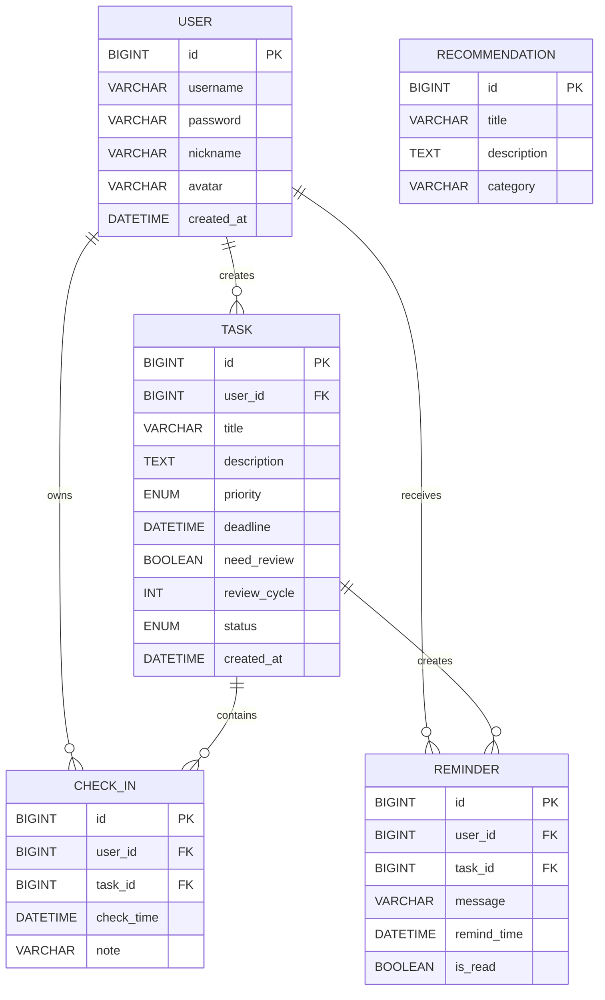
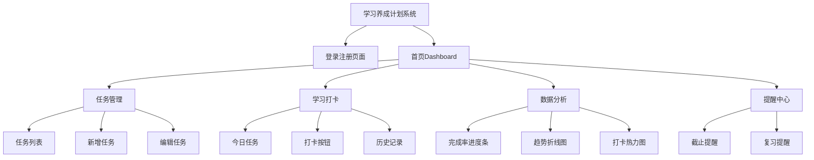

---


# 学习养成计划系统

# 系统设计说明书

（System Design Specification）

---

## 项目名称

学习养成计划系统
Study Habit Planner

---

## 文档版本

V1.0

---

## 编写日期

2026年7月

---

# 目录

## 1 系统体系架构设计

### 1.1 系统总体说明

### 1.2 系统架构设计

### 1.3 系统架构图

## 2 系统功能结构设计

### 2.1 系统功能概述

### 2.2 功能模块划分

### 2.3 功能结构图

## 3 系统动态设计

### 3.1 系统用例分析

### 3.2 系统时序设计

## 4 复杂功能算法设计

## 5 面向对象详细设计

## 6 接口设计

## 7 数据库物理设计

## 8 UI界面设计

---

# 1 系统体系架构设计

## 1.1 系统总体说明

学习养成计划系统是一款面向个人学习者的学习任务管理和习惯养成系统。

系统主要解决学习过程中存在的：

* 学习任务分散
* 学习计划执行困难
* 缺少提醒机制
* 无法直观查看学习成果

等问题。

系统支持：

* 用户注册登录
* 学习任务创建和管理
* 学习任务打卡
* 学习数据统计分析
* 智能任务提醒
* 遗忘曲线复习提醒
* 推荐学习模板

系统核心业务流程如下：

```
用户注册/登录

↓

创建学习任务

↓

执行学习任务

↓

完成学习打卡

↓

查看学习数据

↓

接收任务提醒
```

---

## 1.2 系统架构设计

本系统采用**前后端分离架构**。

整体分为四层：

---

## （1）表现层 Presentation Layer

技术：

* Vue 3
* Element Plus
* ECharts

主要负责：

* 页面展示
* 用户交互
* 数据可视化

包含：

* 登录页面
* 首页Dashboard
* 任务管理页面
* 打卡页面
* 数据分析页面

---

## （2）业务逻辑层 Business Layer

技术：

* Spring Boot 3.x

负责：

* 用户认证
* JWT身份验证
* 任务管理
* 打卡处理
* 提醒算法
* 数据统计

主要服务：

| 服务                | 功能   |
| ----------------- | ---- |
| UserService       | 用户管理 |
| TaskService       | 任务管理 |
| CheckInService    | 打卡处理 |
| StatisticsService | 数据统计 |
| ReminderService   | 提醒生成 |

---

## （3）数据访问层 Data Access Layer

技术：

* MyBatis
* MyBatis Plus

负责：

* 数据查询
* 数据更新
* 数据持久化

---

## （4）数据库层 Database Layer

数据库：

MySQL 8.0

主要数据表：

| 表名             | 说明   |
| -------------- | ---- |
| user           | 用户信息 |
| task           | 学习任务 |
| check_in       | 打卡记录 |
| reminder       | 提醒记录 |
| recommendation | 推荐模板 |

---

# 1.3 系统体系架构图



---

# 2 系统功能结构设计

## 2.1 系统功能概述

系统按照业务划分为六个核心模块：

1. 用户认证模块
2. 学习任务管理模块
3. 打卡管理模块
4. 数据分析模块
5. 智能提醒模块
6. 推荐模板模块

---

# 2.2 功能模块详细设计

## 2.2.1 用户认证模块

功能：

* 用户注册
* 用户登录
* 修改个人资料

输入：

用户名、密码

输出：

用户信息和JWT Token

---

## 2.2.2 学习任务管理模块

功能：

* 创建任务
* 修改任务
* 删除任务
* 查询任务
* 分类筛选
* 优先级排序
* 推荐模板创建任务

任务属性：

| 属性   | 说明         |
| ---- | ---------- |
| 标题   | 任务名称       |
| 描述   | 详细内容       |
| 优先级  | 高中低        |
| 截止时间 | 完成期限       |
| 复习周期 | 复习提醒间隔     |
| 状态   | 待完成/进行中/完成 |

---

## 2.2.3 打卡管理模块

功能：

* 完成任务打卡
* 保存学习记录
* 查看历史记录
* 打卡日历展示

---

## 2.2.4 数据分析模块

功能：

* 完成率统计
* 学习趋势分析
* 打卡热力图

展示：

* 进度条
* 折线图
* 日历图

---

## 2.2.5 智能提醒模块

功能：

根据：

* 截止日期
* 优先级
* 完成状态
* 复习周期

自动生成提醒。

---

## 2.2.6 推荐模板模块

功能：

* 查看系统模板
* 快速创建学习任务

例如：

* 每日背单词
* 每日算法训练
* 每日阅读
* 周复习计划

---

# 2.3 系统功能结构图



---

# 3 系统动态设计

## 3.1 系统用例分析

系统主要参与者包括：

| 参与者    | 类型    | 说明           |
| ------ | ----- | ------------ |
| 学习者    | 主要参与者 | 使用系统进行学习任务管理 |
| 系统定时任务 | 辅助参与者 | 自动检测任务并生成提醒  |

系统主要用例：

| 编号    | 用例名称   | 描述         |
| ----- | ------ | ---------- |
| UC-01 | 用户注册   | 创建系统账号     |
| UC-02 | 用户登录   | 身份验证进入系统   |
| UC-03 | 编辑资料   | 修改用户信息     |
| UC-04 | 创建学习任务 | 创建新的学习计划   |
| UC-05 | 管理任务   | 修改、删除、筛选任务 |
| UC-06 | 添加推荐模板 | 快速生成任务     |
| UC-07 | 完成任务打卡 | 记录学习行为     |
| UC-08 | 查看打卡记录 | 查看历史学习情况   |
| UC-09 | 查看数据分析 | 查看学习统计数据   |
| UC-10 | 接收提醒   | 接收任务和复习提醒  |

---

## 3.1.1 系统用例图



---

# 3.2 系统时序设计

## 3.2.1 创建任务并完成打卡时序图

### 功能描述

该流程描述用户从登录系统开始，到创建学习任务、完成学习并打卡的全过程。

参与对象：

* 用户
* Vue前端
* Spring Boot后端
* MySQL数据库
* 定时提醒服务

---

## 时序图



---

# 3.2.2 时序图说明

### （1）用户登录阶段

用户输入用户名和密码：

```
用户
 ↓
Vue
 ↓
Spring Boot
 ↓
数据库
```

系统验证成功后：

* 返回用户信息
* 生成 JWT Token
* 允许访问系统

---

### （2）任务创建阶段

用户填写：

* 任务标题
* 截止时间
* 优先级
* 是否需要复习

系统：

1. 接收任务请求
2. 保存任务数据
3. 返回任务详情

数据库新增：

```
Task记录
```

---

### （3）任务打卡阶段

用户完成学习：

点击：

```
完成任务
```

系统：

1. 创建 CheckIn 数据
2. 更新任务状态

状态变化：

```
TODO
 ↓
DONE
```

---

### （4）提醒阶段

系统定时任务周期执行：

```
扫描任务
↓
判断截止时间
↓
生成Reminder
↓
通知用户
```

---

# 3.2.3 数据分析查看时序图

## 功能说明

用户查看学习统计数据，包括：

* 任务完成率
* 打卡次数
* 学习趋势
* 日历热力图

---

## Mermaid时序图



---

# 4 复杂功能算法设计

## 4.1 智能提醒算法设计

## 4.1.1 算法目标

系统根据：

* 任务截止日期
* 当前时间
* 任务优先级
* 复习周期

自动判断是否需要提醒。

---

## 4.1.2 算法流程图



---

# 4.2 提醒算法伪代码

```text
Algorithm TaskReminder()

Input:
    TaskList

Begin
    For each task in TaskList:
        If task.status != DONE:
            remainTime = task.deadline - currentTime

            If remainTime < 0:
                createReminder("任务已经逾期")
            Else If remainTime <= 3 days:
                createReminder("任务即将截止")
            Else:
                continue
    End For

    For each completedTask:
        If completedTask.needReview == true:
            reviewDate = finishDate + reviewCycle
            If currentTime >= reviewDate:
                createReminder("请进行知识复习")
End
```

---

# 5 面向对象详细设计

## 5.1 系统核心类设计

系统主要实体类：

* User
* Task
* CheckIn
* Reminder
* Recommendation

---

# 5.2 UML类图



---

# 5.3 类详细说明

## User 用户类

| 属性       | 类型     | 说明   |
| -------- | ------ | ---- |
| id       | Long   | 用户编号 |
| username | String | 用户名  |
| password | String | 密码   |
| nickname | String | 昵称   |
| avatar   | String | 头像   |

方法：

| 方法           | 功能   |
| ------------ | ---- |
| register()   | 注册用户 |
| login()      | 用户登录 |
| updateInfo() | 修改资料 |

---

## Task任务类

属性：

| 属性       | 说明   |
| -------- | ---- |
| title    | 任务名称 |
| deadline | 截止时间 |
| priority | 优先级  |
| status   | 任务状态 |

方法：

| 方法         | 功能   |
| ---------- | ---- |
| create()   | 创建任务 |
| update()   | 修改任务 |
| delete()   | 删除任务 |
| complete() | 完成任务 |

---

## CheckIn打卡类

作用：

保存用户学习行为。

主要字段：

* 打卡时间
* 用户ID
* 任务ID

---

## Reminder提醒类

作用：

生成：

* 截止提醒
* 逾期提醒
* 复习提醒

---

## Recommendation推荐模板类

作用：

提供系统预设学习计划。

例如：

```
每日背单词
每日算法题
周复习计划
```

---

# 6 接口设计

## 6.1 接口设计原则

系统采用 **RESTful API 架构**，前后端通过 HTTP 协议进行数据交互。

设计原则：

1. 接口资源使用名词表示
2. 使用 HTTP 方法区分操作
3. 返回统一 JSON 格式
4. 使用 JWT Token 进行身份认证
5. 所有接口均进行参数校验

---

# 6.2 接口统一返回格式

## 成功返回

```json
{
    "code": 200,
    "message": "success",
    "data": {}
}
```

## 失败返回

```json
{
    "code": 400,
    "message": "参数错误",
    "data": null
}
```

---

# 6.3 用户认证接口设计

## 6.3.1 用户注册

### URL

```
POST /api/user/register
```

### 请求参数

| 参数       | 类型     | 说明  |
| -------- | ------ | --- |
| username | string | 用户名 |
| password | string | 密码  |

### 请求示例

```json
{
    "username": "student",
    "password": "123456"
}
```

### 返回

```json
{
    "code": 200,
    "message": "注册成功"
}
```

---

## 6.3.2 用户登录

### URL

```
POST /api/user/login
```

请求：

```json
{
    "username": "student",
    "password": "123456"
}
```

返回：

```json
{
    "code": 200,
    "data": {
        "token": "xxxxx",
        "username": "student"
    }
}
```

---

# 6.4 任务管理接口

## 6.4.1 创建学习任务

接口：

```
POST /api/tasks
```

请求：

```json
{
    "title": "学习Java",
    "description": "完成Spring Boot学习",
    "priority": "HIGH",
    "deadline": "2026-07-20",
    "needReview": true,
    "reviewCycle": 7
}
```

返回：

```json
{
    "code": 200,
    "message": "创建成功"
}
```

---

## 6.4.2 查询任务列表

接口：

```
GET /api/tasks
```

请求参数：

| 参数       | 说明   |
| -------- | ---- |
| status   | 任务状态 |
| priority | 优先级  |
| date     | 日期   |

返回：

```json
[
    {
        "id": 1,
        "title": "学习Java",
        "status": "TODO"
    }
]
```

---

## 6.4.3 修改任务

接口：

```
PUT /api/tasks/{id}
```

功能：

* 修改任务标题
* 修改截止时间
* 修改优先级

---

## 6.4.4 删除任务

接口：

```
DELETE /api/tasks/{id}
```

---

# 6.5 打卡接口设计

## 完成任务打卡

接口：

```
POST /api/checkin/{taskId}
```

请求：

```json
{
    "note": "完成Spring Boot章节学习"
}
```

处理：

1. 创建CheckIn记录
2. 更新Task状态

返回：

```json
{
    "code": 200,
    "message": "打卡成功"
}
```

---

# 6.6 数据分析接口

## 获取统计数据

接口：

```
GET /api/statistics/overview
```

返回：

```json
{
    "totalTask": 20,
    "finishTask": 15,
    "rate": 75,
    "checkCount": 30
}
```

---

## 获取打卡日历数据

接口：

```
GET /api/checkin/calendar
```

参数：

```
year=2026
month=7
```

返回：

```json
[
    ["2026-07-01", 2],
    ["2026-07-02", 1]
]
```

---

# 6.7 提醒接口

## 查询提醒

接口：

```
GET /api/reminder/list
```

返回：

```json
[
    {
        "message": "Java学习任务即将截止",
        "time": "2026-07-10"
    }
]
```

---

# 6.8 API接口总表

| 模块 | 接口                       | 方法     | 功能   |
| -- | ------------------------ | ------ | ---- |
| 用户 | /api/user/register       | POST   | 注册   |
| 用户 | /api/user/login          | POST   | 登录   |
| 任务 | /api/tasks               | POST   | 创建任务 |
| 任务 | /api/tasks               | GET    | 查询任务 |
| 任务 | /api/tasks/{id}          | PUT    | 修改任务 |
| 任务 | /api/tasks/{id}          | DELETE | 删除任务 |
| 打卡 | /api/checkin/{taskId}    | POST   | 完成打卡 |
| 统计 | /api/statistics/overview | GET    | 统计分析 |
| 日历 | /api/checkin/calendar    | GET    | 查看日历 |
| 提醒 | /api/reminder/list       | GET    | 查看提醒 |

---

# 7 数据库物理设计

## 7.1 数据库设计说明

数据库采用：

```
MySQL 8.0
```

字符集：

```
utf8mb4
```

存储引擎：

```
InnoDB
```

数据库名称：

```
study_habit_planner
```

---

# 7.2 数据库整体结构图



---

# 7.3 用户表 user

表名：

```
user
```

| 字段         | 类型           | 约束       | 说明   |
| ---------- | ------------ | -------- | ---- |
| id         | BIGINT       | PK       | 用户编号 |
| username   | VARCHAR(50)  | UNIQUE   | 用户名  |
| password   | VARCHAR(255) | NOT NULL | 密码   |
| nickname   | VARCHAR(50)  | NULL     | 昵称   |
| avatar     | VARCHAR(255) | NULL     | 头像   |
| created_at | DATETIME     | NOT NULL | 创建时间 |

---

SQL：

```sql
CREATE TABLE user(
    id BIGINT PRIMARY KEY AUTO_INCREMENT,
    username VARCHAR(50) UNIQUE NOT NULL,
    password VARCHAR(255) NOT NULL,
    nickname VARCHAR(50),
    avatar VARCHAR(255),
    created_at DATETIME DEFAULT CURRENT_TIMESTAMP
);
```

---

# 7.4 任务表 task

| 字段           | 类型           | 说明   |
| ------------ | ------------ | ---- |
| id           | BIGINT       | 任务编号 |
| user_id      | BIGINT       | 用户编号 |
| title        | VARCHAR(200) | 任务标题 |
| description  | TEXT         | 描述   |
| priority     | ENUM         | 优先级  |
| deadline     | DATETIME     | 截止时间 |
| need_review  | TINYINT      | 是否复习 |
| review_cycle | INT          | 复习周期 |
| status       | ENUM         | 状态   |

SQL：

```sql
CREATE TABLE task(
    id BIGINT PRIMARY KEY AUTO_INCREMENT,
    user_id BIGINT NOT NULL,
    title VARCHAR(200) NOT NULL,
    description TEXT,
    priority ENUM('HIGH', 'MEDIUM', 'LOW'),
    deadline DATETIME NOT NULL,
    need_review BOOLEAN DEFAULT FALSE,
    review_cycle INT,
    status ENUM('TODO', 'IN_PROGRESS', 'DONE')
);
```

---

# 7.5 打卡表 check_in

| 字段         | 类型           |
| ---------- | ------------ |
| id         | BIGINT       |
| user_id    | BIGINT       |
| task_id    | BIGINT       |
| check_time | DATETIME     |
| note       | VARCHAR(500) |

SQL：

```sql
CREATE TABLE check_in(
    id BIGINT PRIMARY KEY AUTO_INCREMENT,
    user_id BIGINT,
    task_id BIGINT,
    check_time DATETIME DEFAULT CURRENT_TIMESTAMP,
    note VARCHAR(500)
);
```

---

# 7.6 提醒表 reminder

| 字段          | 类型       |
| ----------- | -------- |
| id          | BIGINT   |
| user_id     | BIGINT   |
| task_id     | BIGINT   |
| message     | VARCHAR  |
| remind_time | DATETIME |
| is_read     | BOOLEAN  |

SQL：

```sql
CREATE TABLE reminder(
    id BIGINT PRIMARY KEY AUTO_INCREMENT,
    user_id BIGINT,
    task_id BIGINT,
    message VARCHAR(500),
    remind_time DATETIME,
    is_read BOOLEAN DEFAULT FALSE
);
```

---

# 7.7 数据库索引设计

## task表

```sql
CREATE INDEX idx_task_user ON task(user_id);
CREATE INDEX idx_task_status ON task(status);
CREATE INDEX idx_task_deadline ON task(deadline);
```

作用：

* 提高任务查询速度
* 加快提醒扫描

---

# 8 UI界面设计

## 8.1 UI设计原则

设计目标：

* 简洁
* 易操作
* 数据可视化
* 降低学习成本

设计规范：

* 主色调简洁
* 卡片式布局
* 响应式设计

---

# 8.2 系统页面结构图



---

# 8.3 登录页面设计

功能：

* 输入用户名
* 输入密码
* 登录
* 注册

界面：

```
--------------------------------
         学习养成计划

    用户名：
    [                 ]

    密码：
    [                 ]

           [ 登录 ]

         注册账号
--------------------------------
```

---

# 8.4 首页 Dashboard设计

页面组成：

```
--------------------------------
    欢迎回来！

    今日任务
    □ 学习Java
    □ 完成算法题

    学习进度
    ████████ 80%

    连续学习
    15天
--------------------------------
```

---

# 8.5 任务管理页面

功能：

* 查看任务
* 创建任务
* 修改任务
* 删除任务

界面：

```
------------------------------------------------
任务名称     优先级      截止时间      状态
Java学习       高        7-20        未完成
英语学习       中        7-25        完成

[新增任务]
------------------------------------------------
```

---

# 8.6 数据分析页面

展示：

## （1）任务完成率

示例：

```
完成率
█████████ 75%
```

---

## （2）学习趋势

折线图：

```
学习次数
 ^
 |
 |       *
 |    *
 | *
 ---------------->
      日期
```

---

## （3）打卡热力图

类似：

```
六月学习记录

□ □ ■ □ □
■ ■ ■ □ ■
□ ■ ■ ■ □
```

---

# 8.7 UI组件设计

| 页面   | 组件           |
| ---- | ------------ |
| 登录页  | Form表单       |
| 任务页  | Table表格      |
| 新增任务 | Dialog弹窗     |
| 分析页  | ECharts图表    |
| 提醒页  | Notification |

---

# 9 系统总结

学习养成计划系统采用：

```
Vue3 + Spring Boot + MySQL + MyBatis
```

的前后端分离架构。

系统实现：

✅ 用户管理
✅ 学习任务管理
✅ 智能提醒
✅ 学习打卡
✅ 数据统计分析
✅ 推荐学习计划

通过模块化设计、面向对象建模以及 RESTful 接口设计，提高系统：

* 可维护性
* 可扩展性
* 易用性
* 稳定性

系统满足个人学习管理需求，可帮助用户建立持续学习习惯。
