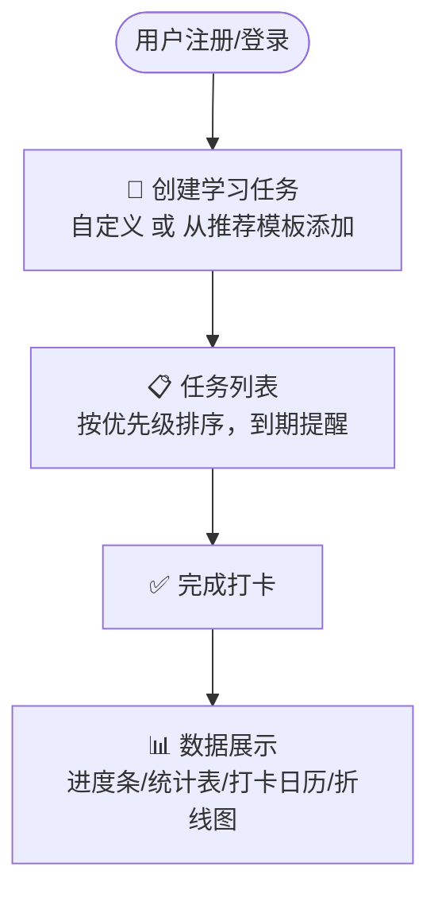
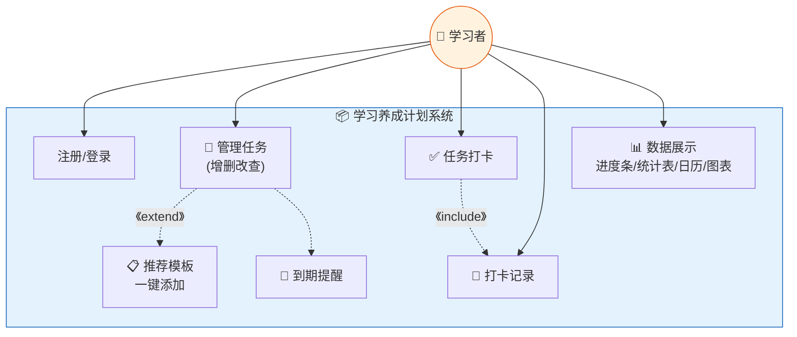
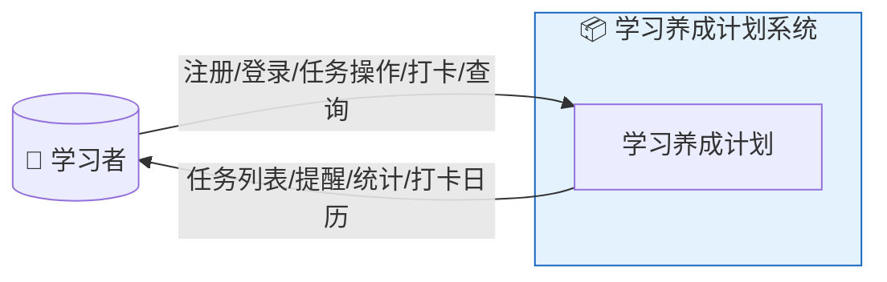
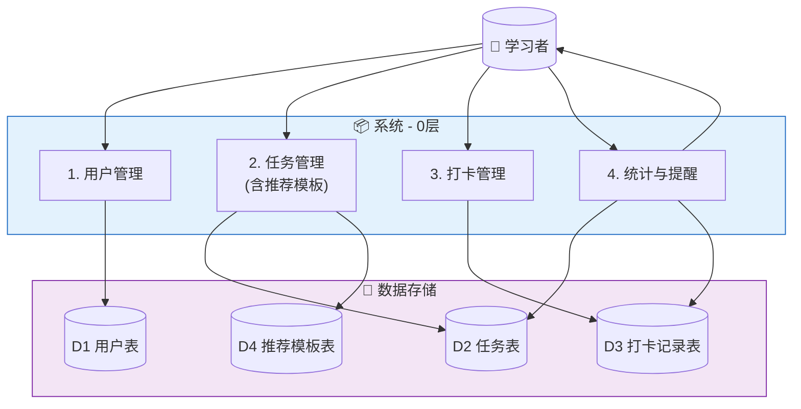
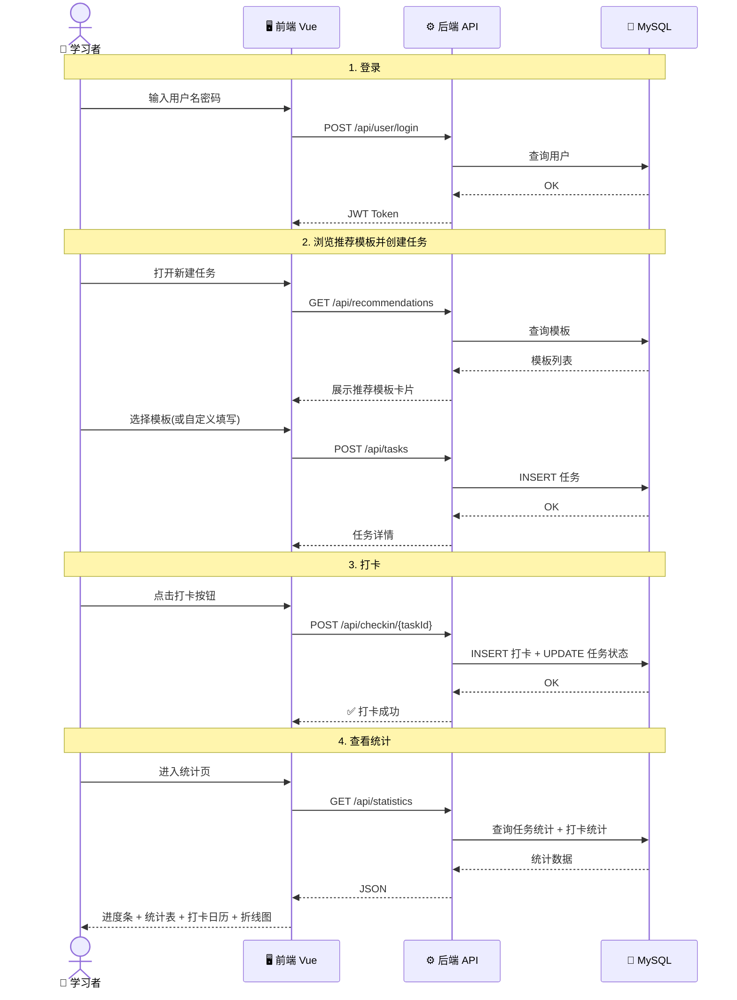
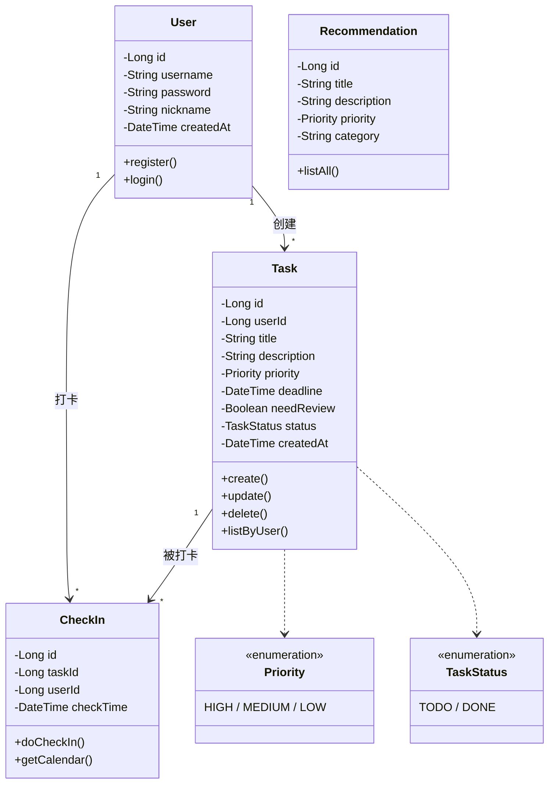
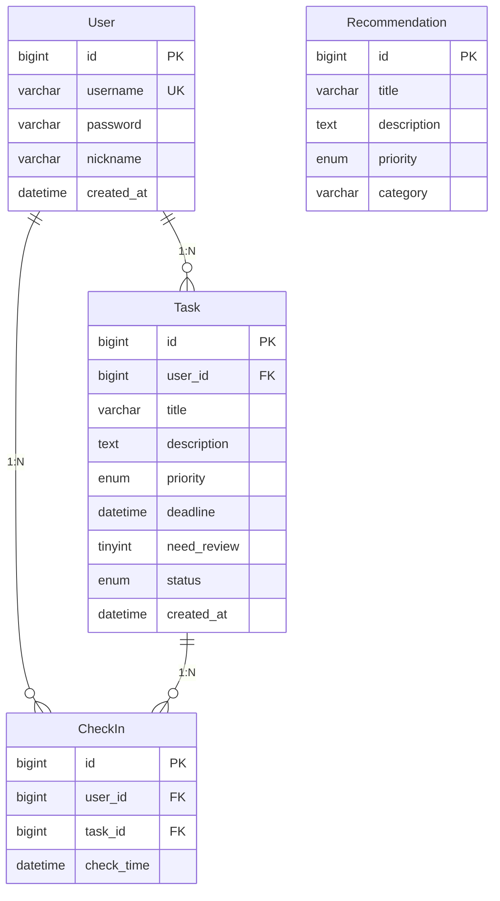

# 学习养成计划 — 软件需求规格说明书

> **项目名称**：学习养成计划（Study Habit Planner）
> **课程**：软件系统实践（小学期）
> **团队人数**：2人 | **周期**：1周
> **文档版本**：v3.2 | **编写日期**：2026年7月6日

---

## 1. 项目背景

### 1.1 问题描述

学习者日常面临任务碎片化、容易拖延、缺乏进度反馈等问题。本项目实现一个简单的任务管理与习惯养成工具，帮助用户规划学习任务、通过打卡记录学习行为，并以可视化方式展示学习数据。

### 1.2 项目定位

**小学期一周实践项目**，目的不是做出完善的产品，而是经历"需求分析→设计→编码→测试"的完整流程。功能上覆盖课程要求的核心点，实现方式尽量简单。

### 1.3 核心功能

| 优先级 | 功能模块 | 说明 |
|--------|---------|------|
| P0 | 用户注册/登录 | JWT 认证 |
| P0 | 任务管理 | 自定义任务，设置主题、截止时间、优先级、复习提醒标记 |
| P0 | 打卡系统 | 完成任务打卡，生成打卡记录 |
| P0 | 数据展示 | 进度条、统计表、打卡日历 |
| P0 | 任务提醒 | 根据截止时间和优先级推送提醒 |
| P1 | 推荐任务 | 系统预置任务模板，用户可一键添加 |
| P1 | 任务分析 | 每日任务添加数和完成率统计（折线图） |

### 1.4 利益相关方

| 利益相关方 | 核心关注点 |
|-----------|-----------|
| 学习者（用户） | 能管理任务、打卡、看到数据和提醒 |
| 课程教师 | 功能覆盖需求点、文档规范、建模完整 |
| 开发团队（2人） | 一周内可完成、技术方案简单可靠 |

---

## 2. 业务需求描述

### 2.1 总体业务流程

### 2.2 User Story

| ID | 用户故事 | 验收标准 | 优先级 |
|----|---------|---------|--------|
| US-01 | 作为用户，我希望能注册和登录 | 注册后能登录，错误密码被拒绝 | P0 |
| US-02 | 作为用户，我希望能创建、编辑、删除学习任务，设置主题、截止时间、优先级和复习提醒 | 任务所有属性正确保存和展示 | P0 |
| US-03 | 作为用户，我希望能从推荐模板中一键添加任务 | 推荐模板列表展示，点击后自动填充表单 | P1 |
| US-04 | 作为用户，希望完成任务后打卡，系统记录打卡时间 | 打卡后状态变为已完成，生成打卡记录 | P0 |
| US-05 | 作为用户，希望以进度条、统计表和打卡日历查看数据 | 可视化组件正确展示数据 | P0 |
| US-06 | 作为用户，希望看到每日任务添加数和完成率趋势图 | 折线图展示变化趋势 | P1 |
| US-07 | 作为用户，希望系统根据截止时间和优先级提醒我 | 任务列表顶部展示即将到期的高优先级任务 | P0 |

---

## 3. 需求分析建模

### 3.1 用例图

### 3.2 数据流图（DFD）

#### 顶层图

#### 0层图

### 3.3 时序图

#### 核心流程：创建任务 → 打卡 → 查看统计

### 3.4 类图（分析类）

---

## 4. 数据库设计

### 4.1 ER 图

### 4.2 数据字典

#### user（用户表）

| 字段 | 类型 | 约束 | 说明 |
|------|------|------|------|
| id | BIGINT | PK, AUTO_INCREMENT | 用户ID |
| username | VARCHAR(50) | UNIQUE, NOT NULL | 用户名 |
| password | VARCHAR(255) | NOT NULL | BCrypt 加密 |
| nickname | VARCHAR(50) | — | 昵称 |
| created_at | DATETIME | DEFAULT NOW() | 创建时间 |

#### task（任务表）

| 字段 | 类型 | 约束 | 说明 |
|------|------|------|------|
| id | BIGINT | PK | 任务ID |
| user_id | BIGINT | FK → user.id | 所属用户 |
| title | VARCHAR(200) | NOT NULL | 任务标题 |
| description | TEXT | — | 任务描述 |
| priority | ENUM('HIGH','MEDIUM','LOW') | DEFAULT 'MEDIUM' | 优先级 |
| deadline | DATETIME | NOT NULL | 截止时间 |
| need_review | TINYINT(1) | DEFAULT 0 | 需复习提醒 |
| status | ENUM('TODO','DONE') | DEFAULT 'TODO' | 状态 |
| created_at | DATETIME | DEFAULT NOW() | 创建时间 |

#### check_in（打卡记录表）

| 字段 | 类型 | 约束 | 说明 |
|------|------|------|------|
| id | BIGINT | PK | 打卡ID |
| user_id | BIGINT | FK → user.id | 用户ID |
| task_id | BIGINT | FK → task.id | 任务ID |
| check_time | DATETIME | DEFAULT NOW() | 打卡时间 |

#### recommendation（推荐模板表）

| 字段 | 类型 | 约束 | 说明 |
|------|------|------|------|
| id | BIGINT | PK | 模板ID |
| title | VARCHAR(200) | NOT NULL | 模板标题 |
| description | TEXT | — | 模板描述 |
| priority | ENUM('HIGH','MEDIUM','LOW') | DEFAULT 'MEDIUM' | 推荐优先级 |
| category | VARCHAR(50) | DEFAULT '通用' | 分类 |

**预置数据**：

| title | description | priority | category |
|-------|-------------|----------|----------|
| 每日背单词 | 每天背诵30个英语单词 | MEDIUM | 英语 |
| 每日刷算法题 | 每天完成1道LeetCode | HIGH | 编程 |
| 每日阅读 | 每天阅读技术书籍30分钟 | MEDIUM | 阅读 |
| 周复习计划 | 每周日复习本周所学内容 | HIGH | 复习 |

---

## 5. 非功能性需求

### 5.1 技术选型

| 层 | 技术 |
|----|------|
| 前端 | Vue 3 + Element Plus + ECharts + Axios |
| 后端 | Spring Boot + MyBatis + JWT |
| 数据库 | MySQL |
| 构建 | Maven + Vite |

### 5.2 质量要求

- 核心功能可正常运行
- 密码 BCrypt 加密存储
- 页面操作流畅，响应时间 2s 内
- 代码有基本注释

### 5.3 开发与运行环境

| 项目 | 说明 |
|------|------|
| JDK | 17+ |
| 数据库 | MySQL 8.0 |
| 前端浏览器 | Chrome |
| IDE | IntelliJ IDEA / VS Code |

---

## 6. 验收标准

| 编号 | 测试项 | 对应用例 | 标准 |
|------|--------|---------|------|
| AT-01 | 注册/登录 | UC01 | 注册后能登录，错误密码被拒绝 |
| AT-02 | 创建任务 | UC02 | 填写所有属性后出现在列表 |
| AT-03 | 推荐模板添加 | UC03 | 模板列表展示，点击一键添加 |
| AT-04 | 编辑/删除任务 | UC02 | 编辑更新正确，删除有确认 |
| AT-05 | 完成任务打卡 | UC04 | 打卡后状态变为已完成，记录时间 |
| AT-06 | 打卡记录查看 | UC05 | 列表展示历史打卡记录 |
| AT-07 | 进度条展示 | UC06 | 准确反映完成率 |
| AT-08 | 统计表展示 | UC06 | 每日添加数/完成数正确 |
| AT-09 | 打卡日历展示 | UC06 | 日历热力图正确反映打卡密度 |
| AT-10 | 折线图展示 | UC06 | 每日完成率趋势正确 |
| AT-11 | 到期提醒 | UC07 | 任务列表顶部展示临近截止的高优任务 |
| AT-12 | 密码安全 | — | 数据库密码为 BCrypt 密文 |

---

> **说明**：本文档为小学期一周实践项目，按照课程"ch5 需求工程"方法论编写，覆盖原始需求全部功能点，以最简单方式实现。
