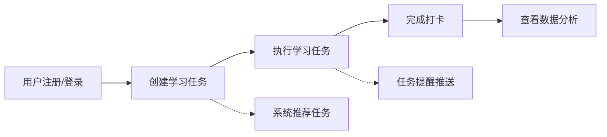
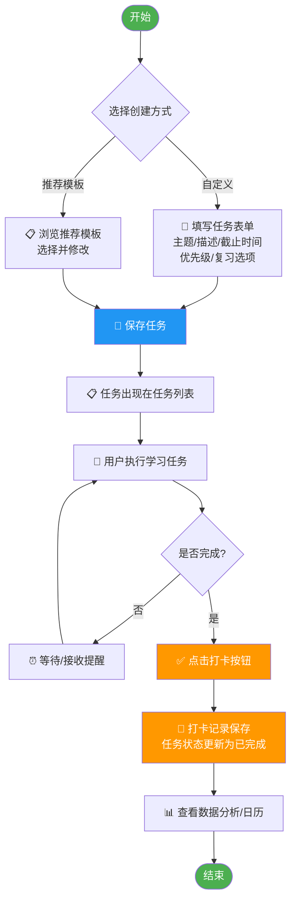
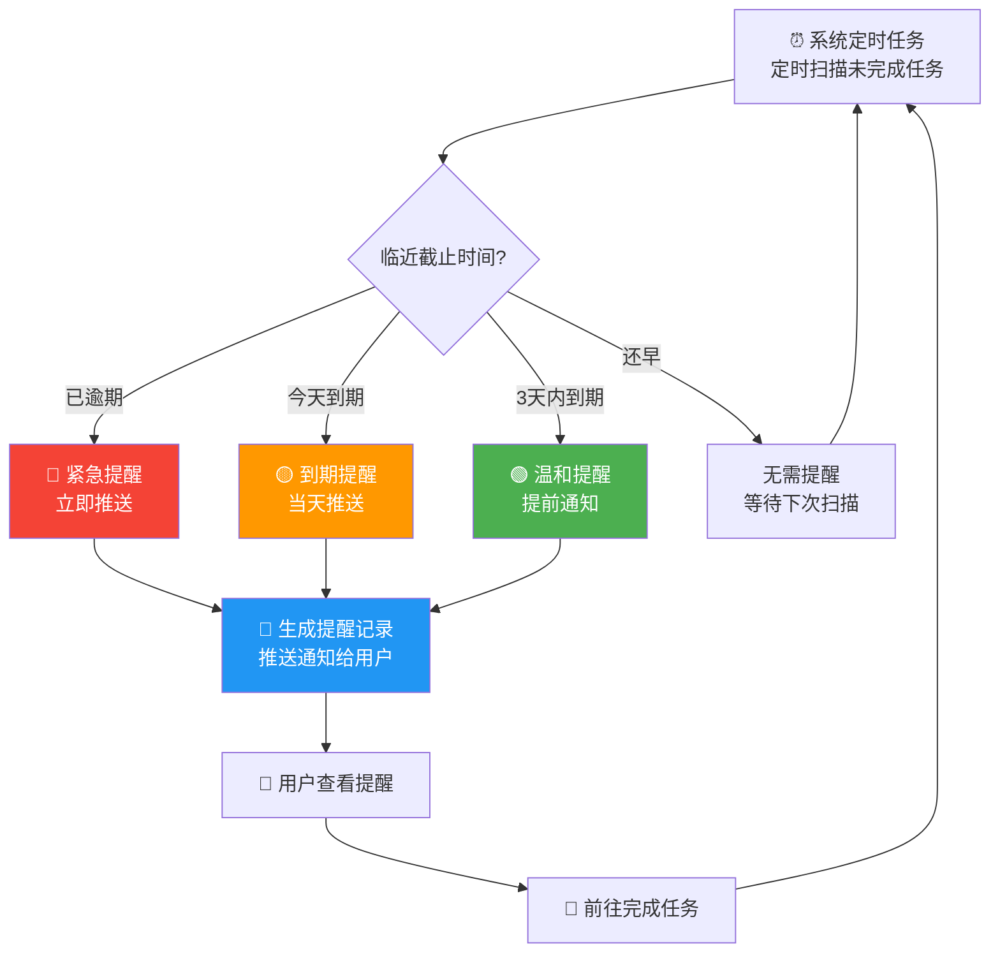
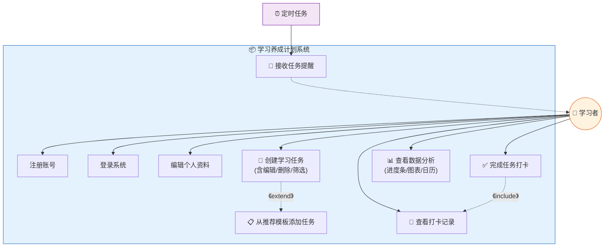
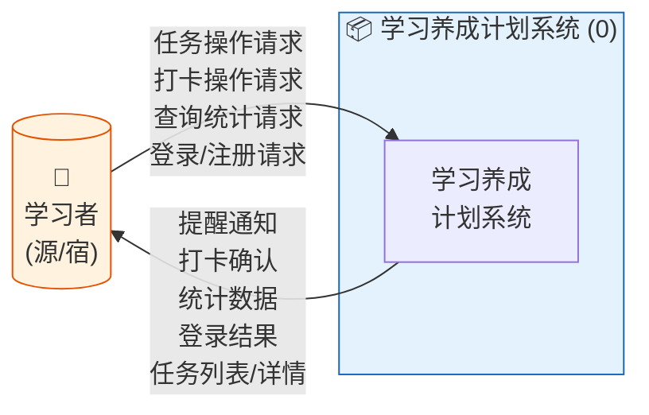
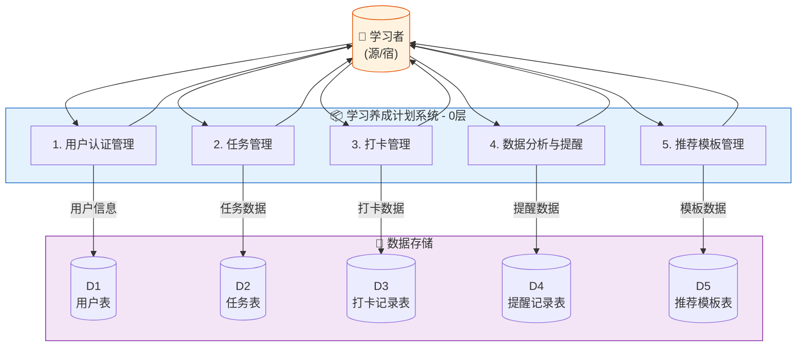
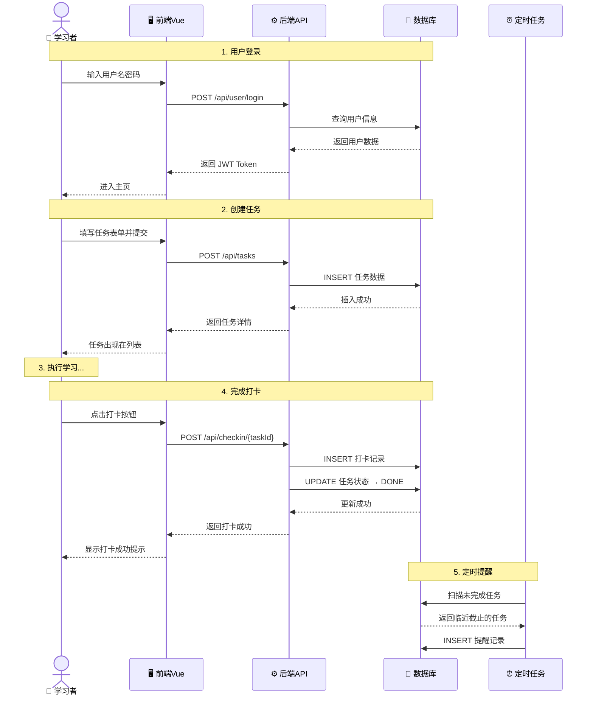
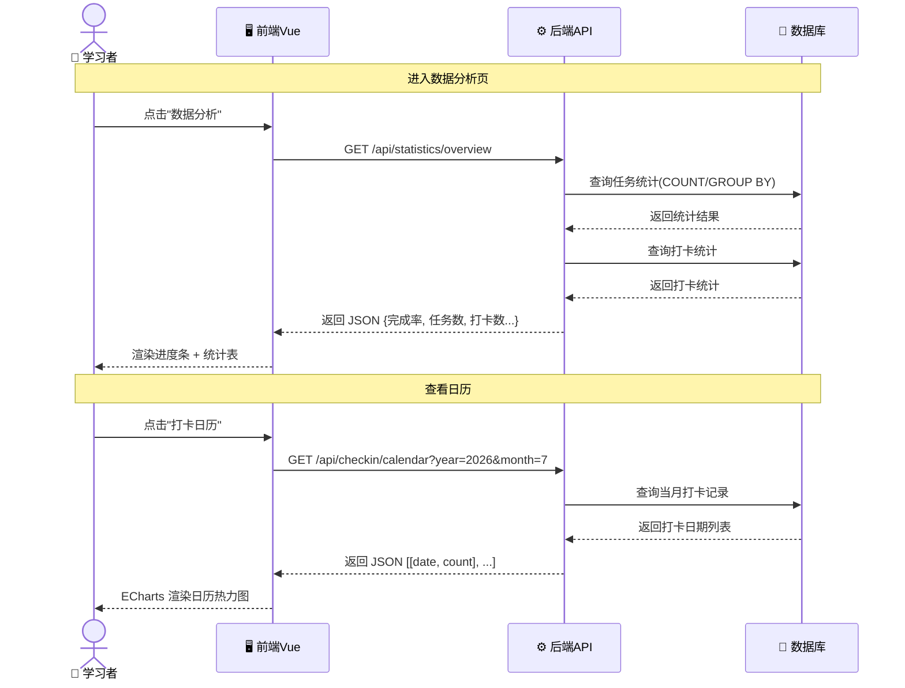
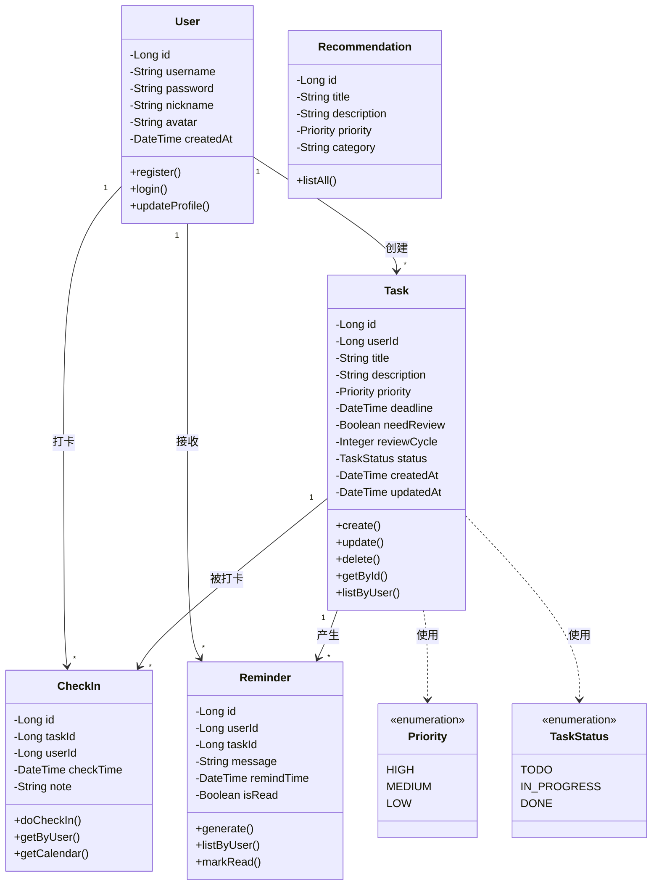
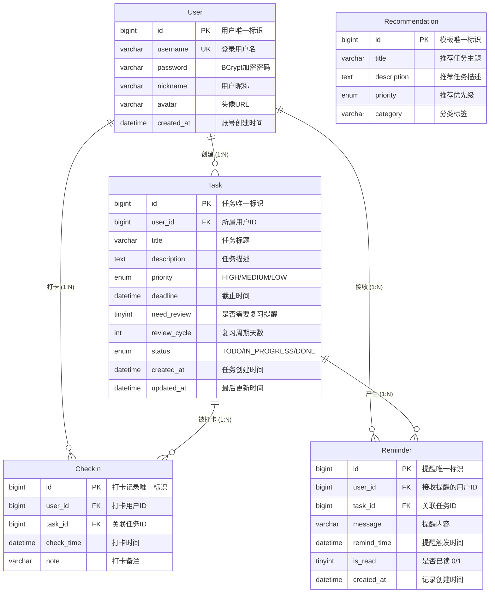

# 学习养成计划 — 软件需求规格说明书

> **项目名称**：学习养成计划（Study Habit Planner）
> **团队人数**：2人 | **难易程度**：中等
> **文档版本**：v2.1 | **编写日期**：2026年7月6日

---

## 目录

1. [软件背景与概述](#1-软件背景与概述)
2. [业务需求分析](#2-业务需求分析)
3. [需求分析建模](#3-需求分析建模)
4. [数据库概念设计与数据字典](#4-数据库概念设计与数据字典)
5. [非功能性需求说明](#5-非功能性需求说明)
6. [验收测试计划](#6-验收测试计划)

---

## 1. 软件背景与概述

### 1.1 问题陈述

在当今信息过载的时代，学习者普遍面临以下痛点：

| 痛点 | 描述 |
|------|------|
| **任务碎片化** | 学习任务来源多样（课程作业、自学计划、考试复习），缺乏统一管理 |
| **拖延症** | 缺乏有效的监督和提醒机制，任务经常被推迟或遗忘 |
| **进度不可视** | 难以直观了解自己的学习进展，缺乏成就感反馈 |
| **遗忘曲线** | 学过的知识如不复习会快速遗忘，但缺乏智能复习提醒 |

### 1.2 解决方案概述

"学习养成计划"是一个面向个人学习者的**任务管理与习惯养成系统**。用户可创建学习任务（支持自定义或从系统推荐模板选取），设置优先级、截止时间和复习策略。通过每日打卡记录学习行为，系统以进度条、统计图表和打卡日历等方式可视化展示学习数据。系统根据任务优先级和截止时间智能推送提醒，帮助用户养成持续学习的习惯。

### 1.3 产品范围

- **包含**：学习任务的增删改查、打卡签到、数据分析可视化、任务提醒、用户认证
- **不包含**：社交功能（分享、评论、排行榜）、第三方平台集成、移动端App

### 1.4 利益相关方

| 利益相关方 | 类型 | 核心关注点 |
|-----------|------|-----------|
| 学习者（学生） | 用户 | 操作便捷、界面友好、提醒及时、数据直观 |
| 课程教师 | 客户/评审者 | 功能完整、遵循软件工程规范、文档齐全 |
| 开发团队 | 开发者 | 需求明确、技术可行、进度可控 |

---

## 2. 业务需求分析

### 2.1 核心业务流程

#### 2.1.1 总体业务流程

#### 2.1.2 任务管理业务流程

#### 2.1.3 任务提醒业务流程

### 2.2 User Story（用户故事）

#### 用户认证模块

| ID | 用户故事 | 验收标准 |
|----|---------|---------|
| US-01 | 作为一个新用户，我希望能够**注册账号**，以便使用系统的全部功能 | 输入用户名和密码后成功创建账号并自动登录 |
| US-02 | 作为一个已注册用户，我希望能够**登录系统**，以便访问我的学习数据 | 输入正确凭证后进入个人主页 |
| US-03 | 作为一个用户，我希望能够**编辑个人资料**，以便完善个人信息 | 可修改昵称、头像、个人简介 |

#### 任务管理模块

| ID | 用户故事 | 验收标准 |
|----|---------|---------|
| US-04 | 作为一个学习者，我希望能够**创建学习任务**，设置主题、截止时间、优先级和是否需要复习提醒，以便合理安排学习计划 | 填写表单后任务出现在任务列表，所有属性正确保存 |
| US-05 | 作为一个学习者，我希望**查看系统推荐的任务模板**，并一键添加到我的任务列表中，以便快速建立学习计划 | 推荐模板列表展示，点击添加后任务自动创建并可在我的任务中查看 |
| US-06 | 作为一个学习者，我希望能够**编辑和删除**已创建的任务，以便灵活调整学习计划 | 编辑后属性正确更新；删除后有确认提示，确认后任务移除 |
| US-07 | 作为一个学习者，我希望能够**按状态、优先级、日期筛选任务**，以便聚焦于当前最需要关注的任务 | 选择筛选条件后任务列表实时更新 |
| US-08 | 作为一个学习者，我希望**任务列表按优先级排序**，高优先级任务置顶展示，以便我优先处理重要任务 | 任务列表默认按优先级降序排列 |

#### 打卡模块

| ID | 用户故事 | 验收标准 |
|----|---------|---------|
| US-09 | 作为一个学习者，我希望**完成任务后点击打卡按钮**进行签到，以便记录我的学习行为 | 点击打卡后系统记录当前时间，任务状态更新为"已完成" |
| US-10 | 作为一个学习者，我希望**以日历热力图的方式查看打卡记录**，以便直观了解自己的学习频率 | 打卡日历正确展示每日打卡情况，颜色深浅表示打卡密度 |
| US-11 | 作为一个学习者，我希望**查看打卡历史记录列表**，以便回顾过去的学习情况 | 列表按时间倒序展示所有打卡记录 |

#### 数据分析模块

| ID | 用户故事 | 验收标准 |
|----|---------|---------|
| US-12 | 作为一个学习者，我希望**看到整体任务完成进度条**，以便了解当前总体进展 | 进度条正确反映已完成任务占总任务的比例 |
| US-13 | 作为一个学习者，我希望**看到每日任务添加数和完成率的统计图表**，以便分析自己的学习趋势 | 折线图/柱状图正确展示数据变化趋势 |
| US-14 | 作为一个学习者，我希望**看到每日打卡的日历视图**，以便直观了解哪些日子坚持了学习 | 日历热力图正确呈现打卡密集程度 |

#### 提醒模块

| ID | 用户故事 | 验收标准 |
|----|---------|---------|
| US-15 | 作为一个学习者，我希望**系统根据任务截止时间和优先级推送提醒**，以免错过重要的学习任务 | 临近截止时间时系统生成提醒通知 |
| US-16 | 作为一个学习者，我希望**接收复习提醒**，以便按照遗忘曲线规律及时巩固知识 | 任务完成后的指定复习周期到达时收到提醒 |

---

## 3. 需求分析建模

### 3.1 用例图（Use Case Diagram）

**执行者说明**：

| 执行者 | 类型 | 描述 |
|--------|------|------|
| 学习者 | 主要执行者 | 使用系统进行学习管理的最终用户，主动触发大部分用例 |
| 定时任务（系统） | 辅助执行者 | 系统内部的定时调度器，自动扫描任务状态并生成提醒 |

**用例详细描述**：

| 用例 | 标识 | 主要执行者 | 简要描述 |
|------|------|-----------|---------|
| 注册账号 | UC-01 | 学习者 | 创建新的用户账号 |
| 登录系统 | UC-02 | 学习者 | 通过身份验证进入系统 |
| 编辑资料 | UC-03 | 学习者 | 修改个人昵称、头像、简介 |
| 创建学习任务 | UC-04 | 学习者 | 创建任务并设置主题、截止时间、优先级、复习选项 |
| 从推荐模板添加任务 | UC-05 | 学习者 | 浏览系统推荐模板，选择并修改后添加（扩展自UC-04） |
| 完成任务打卡 | UC-06 | 学习者 | 完成任务后打卡签到，记录完成时间 |
| 查看打卡记录 | UC-07 | 学习者 | 以列表或日历形式查看历史打卡记录 |
| 查看数据分析 | UC-08 | 学习者 | 查看进度条、统计图表、打卡日历等可视化数据 |
| 接收任务提醒 | UC-09 | 定时任务 | 系统自动扫描临近截止时间的任务，生成提醒通知 |

### 3.2 数据流图（DFD — Data Flow Diagram）

#### 3.2.1 顶层图（Context Diagram）

#### 3.2.2 0层图

**加工说明**：

| 编号 | 加工名称 | 描述 |
|------|---------|------|
| 1 | 用户认证管理 | 处理用户注册、登录、个人资料编辑请求，读写用户表 |
| 2 | 任务管理 | 处理任务的创建、编辑、删除、筛选查询请求，读写任务表 |
| 3 | 打卡管理 | 处理打卡请求，记录打卡时间，更新任务状态，读写打卡记录表 |
| 4 | 数据分析与提醒 | 根据打卡数据生成统计图表，定时扫描生成提醒，读写打卡记录表和提醒记录表 |
| 5 | 推荐模板管理 | 提供系统预置任务模板，供用户浏览和选择添加 |

### 3.3 时序图（Sequence Diagram）

#### 3.3.1 创建任务并打卡

#### 3.3.2 查看数据分析

### 3.4 类图（Class Diagram）— 分析类

**类间关系说明**：

| 关系 | 类A → 类B | 类型 | 多重性 | 说明 |
|------|----------|------|--------|------|
| User → Task | 关联 | 1对多 | 1 : * | 一个用户可创建多个任务 |
| Task → CheckIn | 关联 | 1对多 | 1 : * | 一个任务可有多条打卡记录 |
| User → CheckIn | 关联 | 1对多 | 1 : * | 一个用户有多条打卡记录 |
| User → Reminder | 关联 | 1对多 | 1 : * | 一个用户可收到多条提醒 |
| Task → Reminder | 关联 | 1对多 | 1 : * | 一个任务可产生多条提醒 |
| Task → Priority | 依赖 | — | — | Task 使用 Priority 枚举 |
| Task → TaskStatus | 依赖 | — | — | Task 使用 TaskStatus 枚举 |

---

## 4. 数据库概念设计与数据字典

### 4.1 ER 图（实体—关系图）

### 4.2 完整数据字典

#### 表 1：user（用户表）

| 字段名 | 数据类型 | 长度 | 允许空 | 默认值 | 约束 | 说明 |
|--------|---------|------|--------|--------|------|------|
| id | BIGINT | — | N | — | PK, AUTO_INCREMENT | 用户唯一标识 |
| username | VARCHAR | 50 | N | — | UNIQUE, NOT NULL | 登录用户名 |
| password | VARCHAR | 255 | N | — | NOT NULL | BCrypt 加密密码 |
| nickname | VARCHAR | 50 | Y | NULL | — | 用户昵称/显示名 |
| avatar | VARCHAR | 255 | Y | NULL | — | 头像URL |
| created_at | DATETIME | — | N | CURRENT_TIMESTAMP | — | 账号创建时间 |
| updated_at | DATETIME | — | Y | NULL | ON UPDATE CURRENT_TIMESTAMP | 最后更新时间 |

#### 表 2：task（任务表）

| 字段名 | 数据类型 | 长度 | 允许空 | 默认值 | 约束 | 说明 |
|--------|---------|------|--------|--------|------|------|
| id | BIGINT | — | N | — | PK, AUTO_INCREMENT | 任务唯一标识 |
| user_id | BIGINT | — | N | — | FK → user.id | 所属用户ID |
| title | VARCHAR | 200 | N | — | NOT NULL | 任务主题/标题 |
| description | TEXT | — | Y | NULL | — | 任务详细描述 |
| priority | ENUM('HIGH','MEDIUM','LOW') | — | N | 'MEDIUM' | NOT NULL | 优先级 |
| deadline | DATETIME | — | N | — | NOT NULL | 任务截止时间 |
| need_review | TINYINT(1) | — | N | 0 | — | 是否需要复习提醒 (0/1) |
| review_cycle | INT | — | Y | NULL | — | 复习周期（天），need_review=1时必填 |
| status | ENUM('TODO','IN_PROGRESS','DONE') | — | N | 'TODO' | NOT NULL | 任务状态 |
| created_at | DATETIME | — | N | CURRENT_TIMESTAMP | — | 任务创建时间 |
| updated_at | DATETIME | — | Y | NULL | ON UPDATE CURRENT_TIMESTAMP | 最后更新时间 |

**索引**：
- `idx_task_user_id` ON (user_id)
- `idx_task_status` ON (status)
- `idx_task_deadline` ON (deadline)
- `idx_task_user_status` ON (user_id, status)

#### 表 3：check_in（打卡记录表）

| 字段名 | 数据类型 | 长度 | 允许空 | 默认值 | 约束 | 说明 |
|--------|---------|------|--------|--------|------|------|
| id | BIGINT | — | N | — | PK, AUTO_INCREMENT | 打卡记录唯一标识 |
| user_id | BIGINT | — | N | — | FK → user.id | 打卡用户ID |
| task_id | BIGINT | — | N | — | FK → task.id | 关联任务ID |
| check_time | DATETIME | — | N | CURRENT_TIMESTAMP | NOT NULL | 打卡时间 |
| note | VARCHAR | 500 | Y | NULL | — | 打卡备注（可选） |

**索引**：
- `idx_checkin_user_id` ON (user_id)
- `idx_checkin_task_id` ON (task_id)
- `idx_checkin_user_time` ON (user_id, check_time)
- `idx_checkin_date` ON ((CAST(check_time AS DATE)))

#### 表 4：reminder（提醒记录表）

| 字段名 | 数据类型 | 长度 | 允许空 | 默认值 | 约束 | 说明 |
|--------|---------|------|--------|--------|------|------|
| id | BIGINT | — | N | — | PK, AUTO_INCREMENT | 提醒唯一标识 |
| user_id | BIGINT | — | N | — | FK → user.id | 接收提醒的用户ID |
| task_id | BIGINT | — | N | — | FK → task.id | 关联任务ID |
| message | VARCHAR | 500 | N | — | NOT NULL | 提醒内容 |
| remind_time | DATETIME | — | N | — | NOT NULL | 提醒触发时间 |
| is_read | TINYINT(1) | — | N | 0 | — | 是否已读 (0/1) |
| created_at | DATETIME | — | N | CURRENT_TIMESTAMP | — | 记录创建时间 |

**索引**：
- `idx_reminder_user_id` ON (user_id)
- `idx_reminder_user_read` ON (user_id, is_read)

#### 表 5：recommendation（推荐任务模板表）

| 字段名 | 数据类型 | 长度 | 允许空 | 默认值 | 约束 | 说明 |
|--------|---------|------|--------|--------|------|------|
| id | BIGINT | — | N | — | PK, AUTO_INCREMENT | 模板唯一标识 |
| title | VARCHAR | 200 | N | — | NOT NULL | 推荐任务主题 |
| description | TEXT | — | Y | NULL | — | 推荐任务描述 |
| priority | ENUM('HIGH','MEDIUM','LOW') | — | N | 'MEDIUM' | — | 推荐优先级 |
| category | VARCHAR | 50 | Y | '通用' | — | 分类标签 |

**预置数据示例**：

| title | description | priority | category |
|-------|-------------|----------|----------|
| 每日背单词 | 每天背诵30个英语单词，坚持打卡 | MEDIUM | 英语 |
| 每日刷算法题 | 每天完成1道LeetCode算法题 | HIGH | 编程 |
| 每日阅读 | 每天阅读技术书籍或文献30分钟 | MEDIUM | 阅读 |
| 每日健身 | 每天运动30分钟，保持身体健康 | LOW | 健康 |
| 周复习计划 | 每周日复习本周所学全部内容 | HIGH | 复习 |
| 每日写作 | 每天写200字学习笔记或心得 | MEDIUM | 写作 |

---

## 5. 非功能性需求说明

### 5.1 开发环境

| 项目 | 要求 |
|------|------|
| **操作系统** | Windows 10+ / macOS 12+ / Linux (Ubuntu 20.04+) |
| **JDK版本** | JDK 17 或以上 |
| **构建工具** | Maven 3.8+ |
| **后端框架** | Spring Boot 3.x |
| **ORM框架** | MyBatis / MyBatis-Plus |
| **前端框架** | Vue 3 + Vite + Element Plus |
| **图表库** | ECharts 5.x |
| **HTTP客户端** | Axios |
| **IDE** | IntelliJ IDEA (后端) + VS Code (前端) |
| **版本控制** | Git + GitHub / GitLab |
| **接口测试** | Postman / Apifox |

### 5.2 运行环境

| 项目 | 最低要求 | 推荐配置 |
|------|---------|---------|
| **服务器OS** | Ubuntu 20.04 / Windows 10 | Ubuntu 22.04 |
| **内存** | 2GB RAM | 4GB RAM |
| **存储** | 1GB 可用空间 | 5GB SSD |
| **数据库** | MySQL 8.0+ 或 SQLite 3 | MySQL 8.0+ |
| **浏览器** | Chrome 90+ / Edge 90+ | Chrome 最新版 |
| **屏幕分辨率** | 1366×768 | 1920×1080 |

### 5.3 系统依赖项

#### 后端依赖（Maven pom.xml）

| 依赖 | 版本 | 用途 |
|------|------|------|
| spring-boot-starter-web | 3.x | Web框架 |
| spring-boot-starter-validation | 3.x | 参数校验 |
| mybatis-spring-boot-starter | 3.x | MyBatis集成 |
| mysql-connector-j | 8.x | MySQL驱动 |
| sqlite-jdbc | 3.x | SQLite驱动（单机版可选） |
| jjwt | 0.12.x | JWT认证 |
| lombok | 最新 | 简化POJO代码 |
| spring-boot-starter-test | 3.x | 单元测试 |

#### 前端依赖（package.json）

| 依赖 | 版本 | 用途 |
|------|------|------|
| vue | 3.x | 前端框架 |
| vite | 5.x | 构建工具 |
| vue-router | 4.x | 前端路由 |
| element-plus | 2.x | UI组件库 |
| echarts | 5.x | 数据可视化图表 |
| axios | 1.x | HTTP请求 |
| pinia | 2.x | 状态管理 |

### 5.4 质量需求

| 类别 | 需求标识 | 描述 |
|------|---------|------|
| 性能 | NF-Perf-01 | 页面首次加载时间不超过2秒 |
| 性能 | NF-Perf-02 | API接口响应时间不超过500ms (P95) |
| 可靠性 | NF-Reliability-01 | 用户数据需持久化存储，服务器重启后数据不丢失 |
| 可用性 | NF-Availability-01 | 单机环境下系统7×24小时可用 |
| 易用性 | NF-Usability-01 | 界面简洁直观，核心操作不超过3次点击 |
| 安全性 | NF-Security-01 | 密码使用BCrypt加密存储 |
| 安全性 | NF-Security-02 | 用户只能访问自己的数据（基于JWT的用户隔离） |
| 安全性 | NF-Security-03 | 密码长度不少于6位 |
| 可维护性 | NF-Maintainability-01 | 代码需有合理注释，关键逻辑需说明 |
| 可扩展性 | NF-Extensibility-01 | 前后端分离架构，接口遵循RESTful规范，便于后续扩展 |

### 5.5 约束性需求

| 类别 | 需求标识 | 描述 |
|------|---------|------|
| 技术约束 | NF-Constraint-01 | 后端必须使用Java + Spring Boot |
| 技术约束 | NF-Constraint-02 | 前端必须使用Vue框架 |
| 技术约束 | NF-Constraint-03 | 使用Git进行版本管理，提交记录需可追溯 |
| 进度约束 | NF-Constraint-04 | 在课程规定学期内完成开发和验收 |
| 规模约束 | NF-Constraint-05 | 2人团队，需合理分工覆盖全栈开发 |

---

## 6. 验收测试计划

| 编号 | 测试项 | 对应用例 | 验收标准 | 测试方法 |
|------|--------|---------|---------|---------|
| AT-01 | 用户注册 | UC-01 | 输入有效用户名和密码后成功创建账号 | 功能测试 |
| AT-02 | 用户登录 | UC-02 | 正确凭证登录成功，错误凭证被拒绝并提示 | 功能测试 |
| AT-03 | 编辑个人资料 | UC-03 | 昵称、头像修改成功并持久化 | 功能测试 |
| AT-04 | 创建学习任务 | UC-04 | 填写所有属性后任务出现在列表中 | 功能测试 |
| AT-05 | 推荐模板添加 | UC-05 | 浏览模板并一键添加至任务列表 | 功能测试 |
| AT-06 | 编辑/删除任务 | UC-04 | 编辑后属性更新；删除有确认提示，确认后移除 | 功能测试 |
| AT-07 | 任务筛选 | UC-04 | 按状态/优先级筛选后列表正确更新 | 功能测试 |
| AT-08 | 完成打卡 | UC-06 | 点击打卡后记录时间，任务状态变为"已完成" | 功能测试 |
| AT-09 | 打卡记录查看 | UC-07 | 列表正确展示历史打卡记录 | 功能测试 |
| AT-10 | 打卡日历展示 | UC-07 | 日历热力图正确反映每日打卡密度 | 数据验证 |
| AT-11 | 进度条展示 | UC-08 | 进度条准确反映已完成/总任务比例 | 数据验证 |
| AT-12 | 统计图表展示 | UC-08 | 折线图/柱状图正确呈现任务完成率趋势 | 数据验证 |
| AT-13 | 任务提醒 | UC-09 | 临近截止时间的任务生成提醒通知 | 集成测试 |
| AT-14 | 复习提醒 | UC-09 | 任务完成后指定天数生成复习提醒 | 集成测试 |
| AT-15 | JWT认证 | — | 未登录用户无法访问API；Token过期后需重新登录 | 安全测试 |
| AT-16 | 密码加密 | — | 数据库中密码字段为BCrypt密文 | 安全测试 |
| AT-17 | 数据隔离 | — | 用户A无法查看用户B的任务数据 | 安全测试 |
| AT-18 | 页面响应时间 | — | 页面加载和操作响应在2秒以内 | 性能测试 |
| AT-19 | 浏览器兼容 | — | Chrome、Edge浏览器功能正常 | 兼容性测试 |

---

> **参考文献**：本文档遵循课程"ch5 需求工程"中讲授的需求分析方法论，涵盖 User Story、业务流程图（Mermaid Flowchart）、UML用例图/时序图/类图（Mermaid Sequence/Class）、数据流图（Mermaid Flowchart）、ER图与数据字典（Mermaid ER）、非功能性需求等完整内容。所有图表使用 Mermaid 语法编写，可在 VS Code（安装 "Markdown Preview Mermaid Support" 插件）、GitHub、GitLab、Typora 等平台直接渲染。
