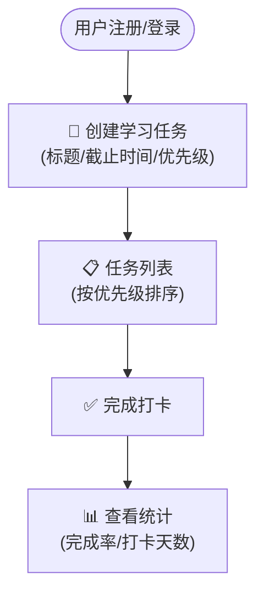
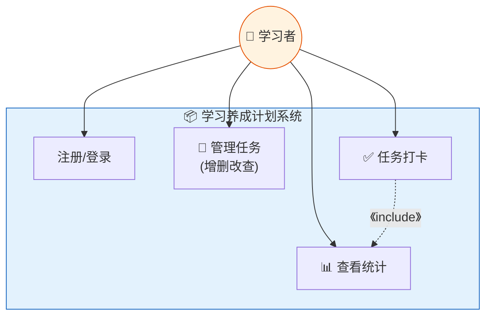
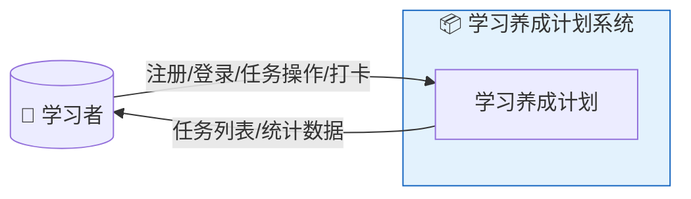
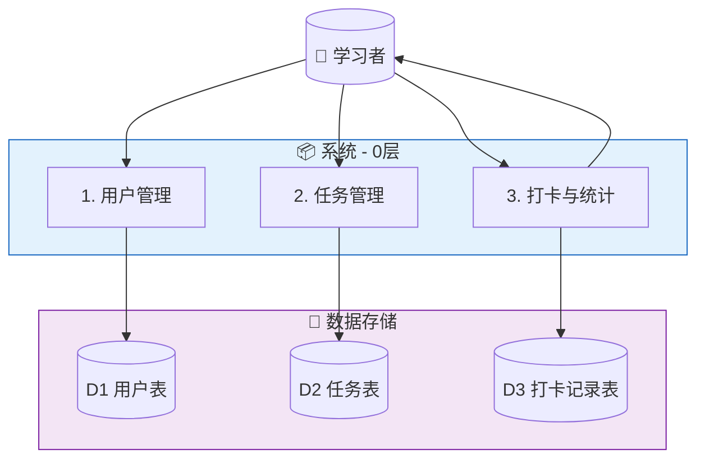
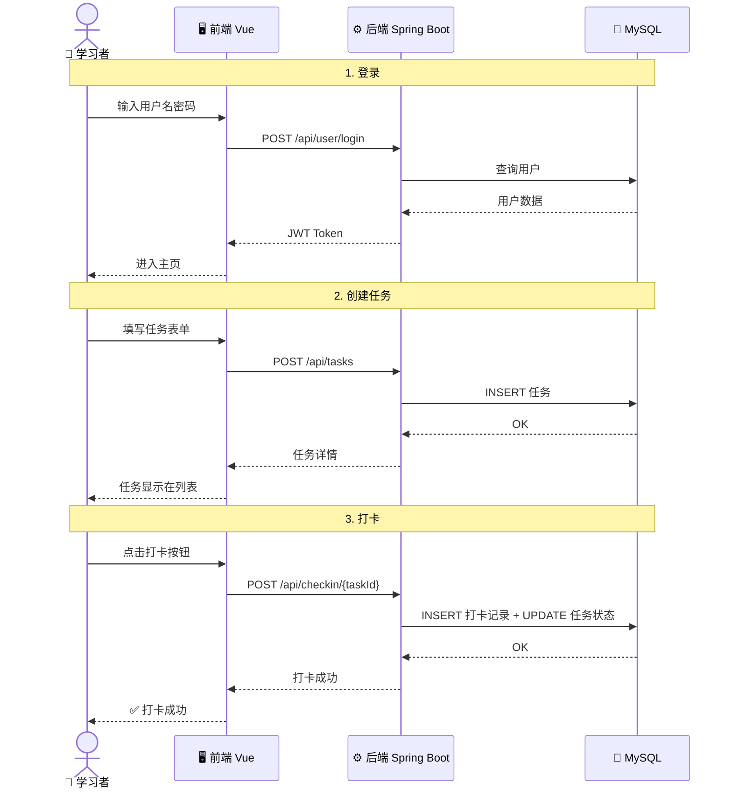
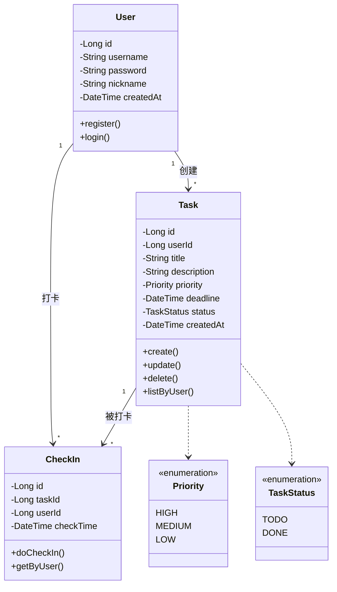
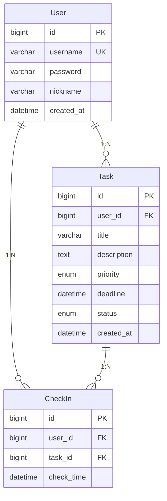

# 学习养成计划 — 软件需求规格说明书

> **项目名称**：学习养成计划（Study Habit Planner）
> **课程**：软件系统实践（小学期）
> **团队人数**：2人 | **周期**：1周
> **文档版本**：v3.1 | **编写日期**：2026年7月6日

---

## 1. 项目背景

### 1.1 问题描述

学习者日常面临任务碎片化、容易拖延、缺乏进度反馈等问题。本项目旨在通过一个简单的任务管理+打卡工具，帮助用户规划学习任务并记录完成情况。

### 1.2 项目定位

这是一个**小学期一周实践项目**，目的不是做出一个完善的商用产品，而是：
- 经历"需求分析 → 设计 → 编码 → 测试"的完整软件工程流程
- 掌握 UML 建模、数据库设计、前后端分离开发的基本方法
- 产出符合课程要求的软件制品和文档

### 1.3 核心功能

| 优先级 | 功能 | 说明 |
|--------|------|------|
| P0 必做 | 用户注册/登录 | JWT 认证 |
| P0 必做 | 任务增删改查 | 设置标题、截止时间、优先级 |
| P0 必做 | 任务打卡 | 完成任务后打卡记录 |
| P1 争取 | 简单统计 | 完成率、打卡天数 |

### 1.4 利益相关方

| 利益相关方 | 核心关注点 |
|-----------|-----------|
| 学习者（用户） | 能创建任务、打卡、看到进度 |
| 课程教师 | 功能跑通、文档规范、分工明确 |
| 开发团队（2人） | 一周内能完成、技术风险低 |

---

## 2. 业务需求描述

### 2.1 核心流程

### 2.2 User Story

| ID | 用户故事 | 优先级 |
|----|---------|--------|
| US-01 | 作为用户，我希望能注册和登录，以便使用系统 | P0 |
| US-02 | 作为用户，我希望能创建、编辑、删除学习任务 | P0 |
| US-03 | 作为用户，我希望完成任务后打卡，记录完成时间 | P0 |
| US-04 | 作为用户，我希望能看到任务完成率和打卡天数 | P1 |

---

## 3. 需求分析建模

### 3.1 用例图

### 3.2 数据流图（DFD）

#### 顶层图

#### 0层图

### 3.3 时序图 — 核心流程

### 3.4 类图（分析类）

---

## 4. 数据库设计

### 4.1 ER 图

### 4.2 数据字典

#### user（用户表）

| 字段 | 类型 | 约束 | 说明 |
|------|------|------|------|
| id | BIGINT | PK, AUTO_INCREMENT | 用户ID |
| username | VARCHAR(50) | UNIQUE, NOT NULL | 用户名 |
| password | VARCHAR(255) | NOT NULL | BCrypt 加密 |
| nickname | VARCHAR(50) | — | 昵称 |
| created_at | DATETIME | DEFAULT NOW() | 创建时间 |

#### task（任务表）

| 字段 | 类型 | 约束 | 说明 |
|------|------|------|------|
| id | BIGINT | PK | 任务ID |
| user_id | BIGINT | FK → user.id | 所属用户 |
| title | VARCHAR(200) | NOT NULL | 任务标题 |
| description | TEXT | — | 任务描述 |
| priority | ENUM('HIGH','MEDIUM','LOW') | DEFAULT 'MEDIUM' | 优先级 |
| deadline | DATETIME | NOT NULL | 截止时间 |
| status | ENUM('TODO','DONE') | DEFAULT 'TODO' | 状态 |
| created_at | DATETIME | DEFAULT NOW() | 创建时间 |

#### check_in（打卡记录表）

| 字段 | 类型 | 约束 | 说明 |
|------|------|------|------|
| id | BIGINT | PK | 打卡ID |
| user_id | BIGINT | FK → user.id | 用户ID |
| task_id | BIGINT | FK → task.id | 任务ID |
| check_time | DATETIME | DEFAULT NOW() | 打卡时间 |

---

## 5. 非功能性需求

### 5.1 技术选型

| 层 | 技术 |
|----|------|
| 前端 | Vue 3 + Element Plus + Axios |
| 后端 | Spring Boot + MyBatis |
| 数据库 | MySQL（或 SQLite 单机） |
| 认证 | JWT |
| 构建 | Maven (后端) + Vite (前端) |

### 5.2 质量要求

- 核心功能（注册/登录/任务CRUD/打卡）必须可正常运行
- 密码 BCrypt 加密存储
- 界面简洁，基本操作流畅
- 代码有基本注释

### 5.3 运行环境

- 后端：JDK 17 + MySQL 8.0 (或 SQLite)
- 前端：Chrome 浏览器
- 开发工具：IntelliJ IDEA / VS Code

---

## 6. 验收标准

| 编号 | 测试项 | 标准 |
|------|--------|------|
| AT-01 | 用户注册/登录 | 注册后能登录，错误密码被拒绝 |
| AT-02 | 创建任务 | 填写表单后任务出现在列表 |
| AT-03 | 编辑/删除任务 | 编辑后数据更新，删除有确认 |
| AT-04 | 任务打卡 | 打卡后状态变为"已完成"，记录打卡时间 |
| AT-05 | 打卡记录查看 | 可查看历史打卡列表 |
| AT-06 | 简单统计 | 显示任务完成率、打卡天数 |
| AT-07 | 密码安全 | 数据库密码为 BCrypt 密文 |

---

> **说明**：本文档为小学期一周实践项目需求规格说明书，按照课程"ch5 需求工程"方法论编写。聚焦核心链路：注册→建任务→打卡→看统计，能完整跑通即可。
